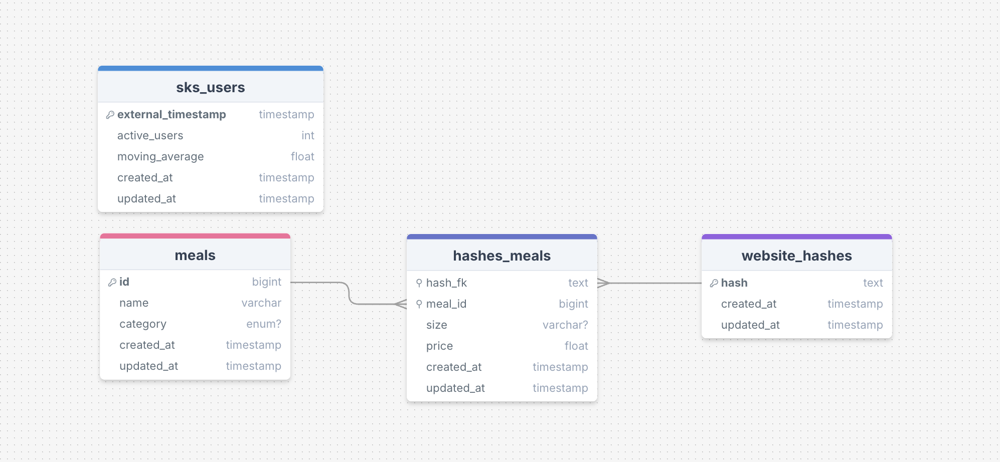

# SKS Menu Scrapper


## Description

SKS Menu Scraper is a tool designed to automatically fetch and parse information about canteen menus, such as dish
names, portion sizes, and prices. The project saves the scraped data into a database and provides a RESTful API for
users to access menu items.

The SKS Menu Scraper also includes a feature that acts as a wrapper for external API to handle and track the number of
canteen users - [source](https://live.pwr.edu.pl/sks/).

## Endpoints

The API is available at `sks-api.topwr.solvro.pl`. The following endpoints are available at the moment:

- **GET** `/api/v1/meals`
  - **Description**: Retrieves list of last scraped menus.
  - **Request**:
    ```bash
    curl -X GET https://sks-api.topwr.solvro.pl/api/v1/meals
    ```
  - **Params**:
    - page (default: 1) - the page number of records to retrieve.
    - limit (default: 10) - the number of records to return per page.
  - **Response**:
    ```json
    [
      {
        "hash": "75e5434015551ef3d22214a4438d1961f9f57e7c0d2a460917bfd4c8dd8b7dda",
        "createdAt": "2024-11-15T12:10:00.545+00:00",
        "updatedAt": "2024-11-15T12:10:00.545+00:00",
        "meals": []
      }
    ]
    ```
- **GET** `/api/v1/meals/current`
  - **Description**: Retrieves a list of all current or saved menu items (indicated by isMenuOnline field), including
    dish names, sizes, and prices.
  - **Request**:
    ```bash
    curl -X GET https://sks-api.topwr.solvro.pl/api/v1/meals/current
    ```
  - **Response**:
    ```json
    {
      "meals": [
        {
          "id": 85,
          "name": "Napój z soku jabłkowo-wiśniowego",
          "category": "DRINK",
          "size": "200ml",
          "price": "2.50",
          "createdAt": "2024-11-08T11:53:38.644+00:00",
          "updatedAt": "2024-11-08T11:53:38.644+00:00"
        },
        {
          "id": 84,
          "name": "Ziemniaki z koperkiem",
          "category": "SIDE_DISH",
          "size": "250g",
          "price": "4.50",
          "createdAt": "2024-11-08T11:53:38.644+00:00",
          "updatedAt": "2024-11-08T11:53:38.644+00:00"
        },
        {
          "id": 82,
          "name": "Pałki drobiowe w ciescie crazy",
          "category": "MEAT_DISH",
          "size": "250g",
          "price": "15.00",
          "createdAt": "2024-11-08T11:53:38.642+00:00",
          "updatedAt": "2024-11-08T11:53:38.642+00:00"
        }
      ],
      "isMenuOnline": true
    }
    ```
- **GET** `/api/v1/sks-users/current`
  - **Description**: Retrieves the latest SKS user data with additional info about trend, whether the data is recent or
    not, and timestamp for the next scheduled update.
  - **Request**:
    ```bash
    curl -X GET https://sks-api.topwr.solvro.pl/api/v1/sks-users/current
    ```
  - **Response**:
    ```json
    {
      "activeUsers": 1,
      "movingAverage21": 49,
      "externalTimestamp": "2024-11-11T13:40:00.000+00:00",
      "createdAt": "2024-11-10T23:00:00.116+00:00",
      "updatedAt": "2024-11-11T13:42:01.017+00:00",
      "trend": "STABLE",
      "isResultRecent": true,
      "nextUpdateTimestamp": "2024-11-11T13:47:31.017+00:00"
    }
    ```
- **GET** `/api/v1/sks-users/today`
  - **Description**: Retrieves the today's data about SKS users count
  - **Request**:
    ```bash
    curl -X GET https://sks-api.topwr.solvro.pl/api/v1/sks-users/today
    ```
  - **Response**:
    ```json
    [
      {
        "activeUsers": 1,
        "movingAverage21": 49,
        "externalTimestamp": "2024-11-11T13:40:00.000+00:00",
        "createdAt": "2024-11-10T23:00:00.116+00:00",
        "updatedAt": "2024-11-11T13:42:01.017+00:00"
      },
      "{...}"
    ]
    ```

## Development

1. Clone the repository:

   ```bash
   git clone https://github.com/Solvro/backend-topwr-sks.git
   cd backend-topwr-sks
   ```

2. Install the required dependencies:

   ```bash
   npm install
   ```

3. Set up the PostgreSQL database:
   - Ensure PostgreSQL is installed and running.
   - Create a new database.
   - Update the `.env` file with your PostgreSQL credentials and database name.

4. Set up the environment variables in the `.env` file using the `.env.example` template.

5. Run migrations to create the database schema:

   ```bash
   node ace migration:run
   ```

6. Run scheduler for scrapper:

   ```bash
    node ace scheduler:run
    # or
    node ace scheduler:work
   ```

   Alternatively run scraping script once and individually:

   ```bash
   node ace scrape:menu
   node ace scrape:users
   ```

7. Start the development server:

   ```bash
   npm run dev
   ```

8. Access the data using:

   ```bash
   curl -X GET http://localhost:3333/api/v1/meals
   ```

## Technologies

- Node.js
- Adonis.js
- PostgreSQL
- Coolify

## Database Schema


