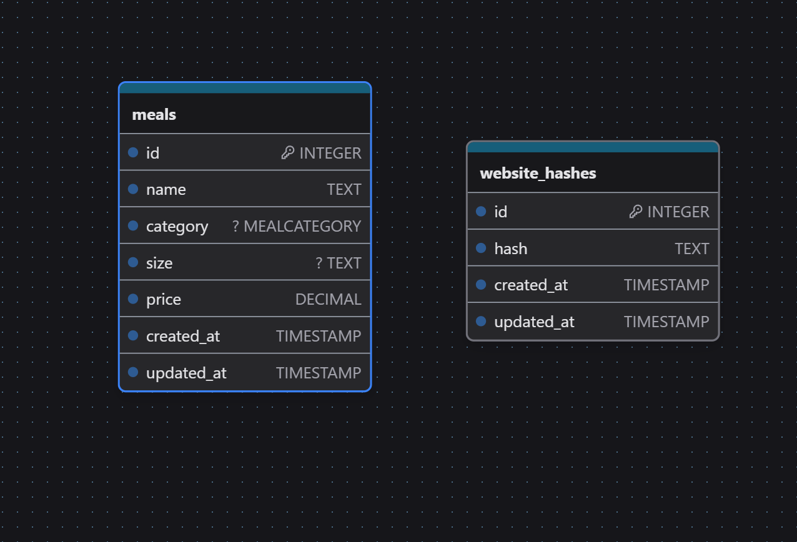

# SKS Menu Scrapper


## Description

SKS Menu Scraper is a tool designed to automatically fetch and parse information about canteen menus, such as dish names, portion sizes, and prices. The project saves the scraped data into a database and provides a RESTful API for users to access menu items.

## Development

1. Clone the repository:

   ```bash
   git clone https://github.com/Solvro/backend-topwr-sks.git
   cd backend-topwr-sks
   ```

2. Install the required dependencies:

   ```bash
   npm install
   ```

3. Set up the environment variables in the `.env` file using the `.env.example` template.

4. Run migrations to create the database schema:

   ```bash
   node ace migration:run
   ```

5. Run scheduler for scrapper:

   ```bash
    node ace scheduler:run
    # or
    node ace scheduler:work
   ```

6. Start the development server:

    ```bash
    npm run dev
    ```
    Alternatively run scraping script once:
    ```bash
    node ace scrape
    ```

   Alternatively run scraping script once:

   ```bash
   node ace scrape
   ```

## Technologies

- Node.js
- Adonis.js
- PostgreSQL

## Database Schema


